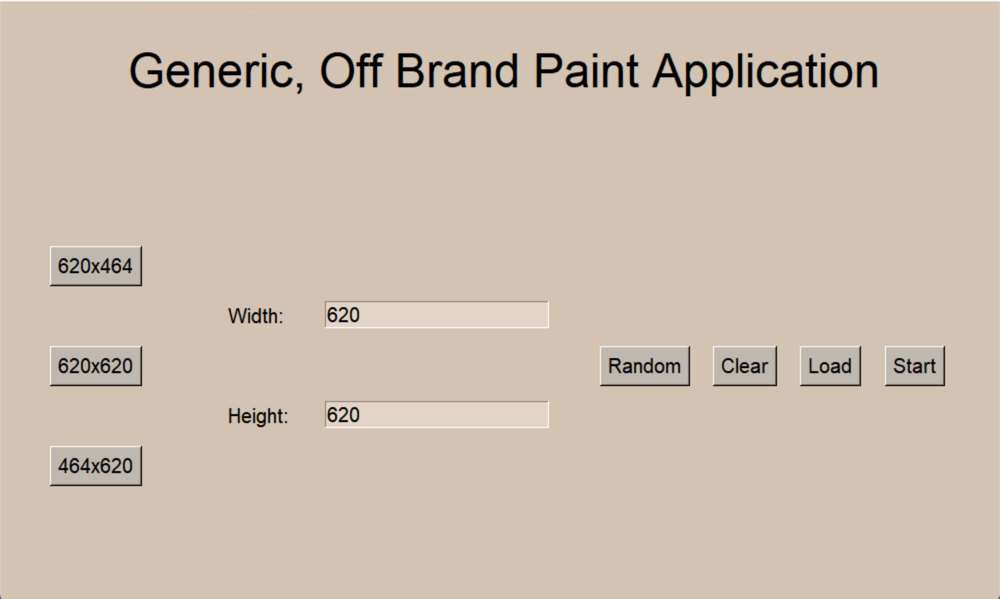
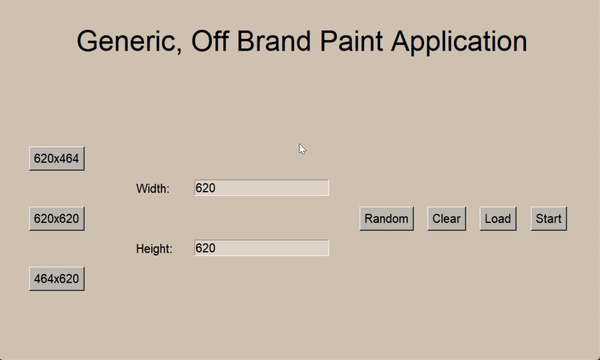
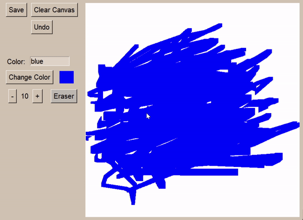

Welcome!

This page contains much of the same information as the github repository (linked above), but with a photo (and two gifs!)! So it's automatically better.

## So, what can you do in the program?

Well, draw. But you also have access to many benefits such as:

1. A user-sizable canvas
2. Multiple colored styluses
3. Changeable brush size
4. An eraser
5. An undo button
6. The ability to save/load canvases

All of which are, admittedly, fairly standard for a painting application, but took much effort for two first-year college students to implement.

### To Download the Application,

Click the 'Download .zip' button located at the top of the page. Inside should be a file named PaintingApplication.py.

If the file isn't located in the downloaded zip, click the button named 'View on GitHub' (also located at the top of the page) to the access the GitHub repository and download the PaintingApplication.py file located within the `main` branch.

### To Run the Application,

Run the downloaded .py file through a Python IDE. The program uses exclusively standard libraries, so there shouldn't be any special requirements to run it.

Happy Drawing!

If, for some reason, there are issues, please contact the co-owner Adara. I will look at the issue and likely give you a "Huh. That's weird." and a shrug.

